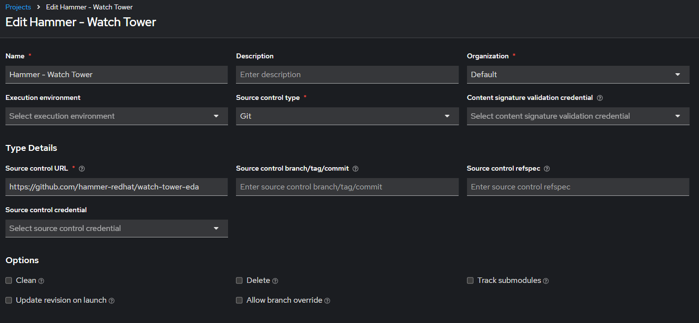

# Watch Tower EDA

Watch Tower EDA is a project designed to monitor and failover a multi-site Ansible Automation Platform deployment on two independent Openshift clusters.

## Table of Contents

- [Overview](#overview)
- [Features](#features)
- [Installation](#installation)
- [Usage](#usage)
- [Contributing](#contributing)
- [License](#license)

## Overview

Watch Tower EDA accomplishes automated failover by managing a multi-site AAP deployment using Ansible playbooks with scheduled runs. Additionally Event-Driven-Ansible is configured to listen and watch for events on the Postgres DB cluster deployed in a highly available architecture. 

## Features   
## Playbooks:
- Check PostgreSQL Database Role: This playbook runs a psql command to determine if the postgres instance is one of the following: _'Primary/Leader, Standby or offline'_.
- Deploy PostgreSQL Trigger: This playbook determines if the `pg_notify` trigger exists, if it doesn't it configures it by running the `files/queue.sql` script located in this repo. 
- Failover EDB: These playbooks were created to simplify triggering the database failover on the EnterpriseDB PostgreSQL cluster we deployed. It utilized the playbooks shipped with tpaexec and is located here - `/opt/EDB/TPA/architectures/M1/commands/switchover.yml`. You can ignore using these playbooks as they're used for demonstrating failover scenarios for this use case.
-  Scale up/down AAP: These playbooks use the `redhat.openshift.k8s` module to apply changes to AAP Custom Resources in Openshift. The playbooks use the following files in this repo:  
    - Scaling up:   
        - aap-cr-up-site1.yml  
        - aap-cr-up-site2.yml
    - Scaling down: 
        - aap-cr-down-site1.yml
        - aap-cr-down-site2.yml
    - These files change line 30 in the files from `replicas: 0` -> `replicas: 1` when scaling up and vice versa.  

## Rulebooks:
- There are two rulebooks preconfigured for you, one to monitor postgres per site. 
    - pg_monitor_rulebook_site1.yml
    - pg_monitor_rulebook_site2.yml
- Within these rulebooks the source is `ansible.eda.pg_listener`. This listens to events published by `pg_notify` commands run in the `check_postgres_role.yml` playbook. 
- After the sources in the rulebook you'll see that they each have two rules based on the `event.postgres_db_role` output generated by the `check_postgres_role.yml` playbook. These trigger the scale up/down functions based on if the condition is met. 

## Execution Environment:
- There is one execution environment that is required to be used that includes the `redhat.openshift` collection and that is included here and can be built using the following steps as an example. 
```
ansible-builder build -f execution_environment/k8s_ee.yml -t k8s_ee
podman images # grab the Image ID to then push to automation hub.
podman login aap.example.com
podman push <paste Image ID> aap.example.com/namespace_example/k8s_ee
```
## Workflow Diagram: 
.png>)

## Installation

To clone and use this project from CLI, follow these steps:

1. **Clone the repository:**

```bash
git clone https://github.com/hammer-redhat/watch-tower-eda.git
```
Navigate to the project directory:
```
cd watch-tower-eda
```
Install dependencies:
```
ansible-galaxy collection install -r requirements.yml
```

## Usage in Ansible Automation Platform:
To use Watch Tower EDA in AAP:  

1. Create a project in AAP and sync the git repository:



